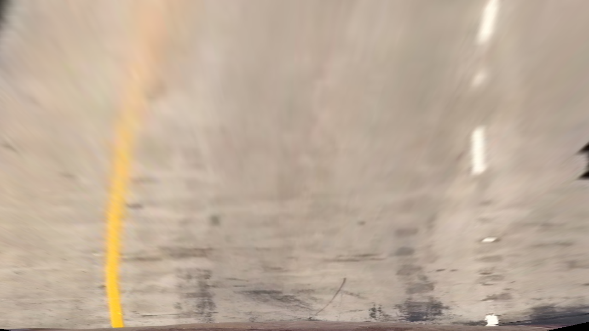
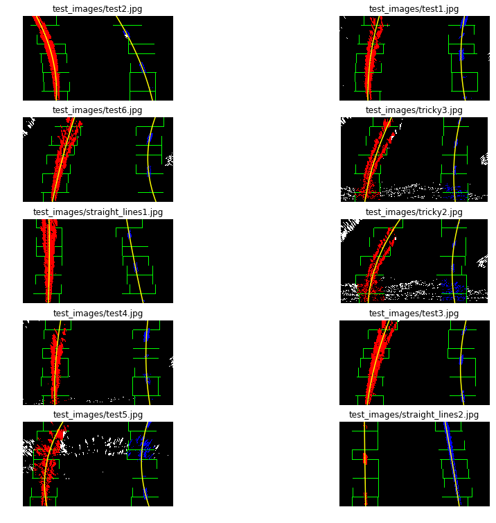
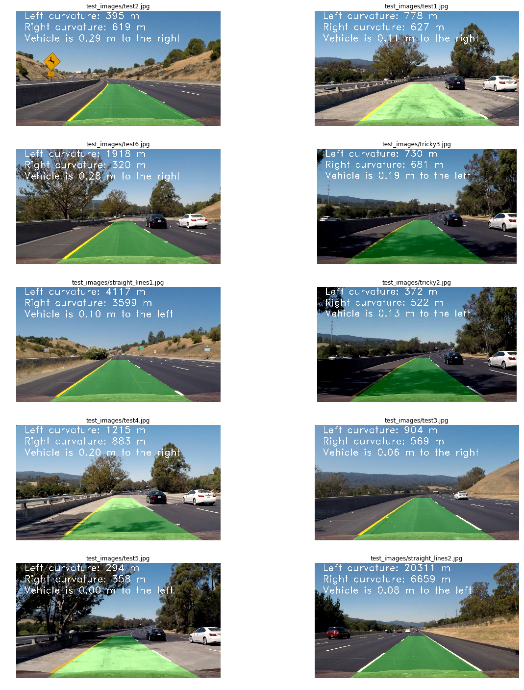

**Advanced Lane Finding Project**

The goals / steps of this project are the following:

* Compute the camera calibration matrix and distortion coefficients given a set of chessboard images.
* Apply a distortion correction to raw images.
* Use color transforms, gradients, etc., to create a thresholded binary image.
* Apply a perspective transform to rectify binary image ("birds-eye view").
* Detect lane pixels and fit to find the lane boundary.
* Determine the curvature of the lane and vehicle position with respect to center.
* Warp the detected lane boundaries back onto the original image.
* Output visual display of the lane boundaries and numerical estimation of lane curvature and vehicle position.

[//]: # (Image References)

[image1]: ./images/original.jpg "Original chessboard"
[image2]: ./images/calibrated_camera_image.jpg "Undistorted chessboard"
[image3]: ./images/example_BGR_B_channel.png "BGR - B channel"
[image4]: ./images/example_BGR_G_channel.png "BGR - G channel"
[image5]: ./images/example_BGR_R_channel.png "BGR - R channel"
[image6]: ./images/example_HSV_H_channel.png "HSV - H channel"
[image7]: ./images/example_HSV_S_channel.png "HSV - S channel"
[image8]: ./images/example_HSV_V_channel.png "HSV - V channel"
[image9]: ./images/example_HLS_H_channel.png "HSV - H channel"
[image10]: ./images/example_HLS_L_channel.png "HSV - L channel"
[image11]: ./images/example_HLS_S_channel.png "HSV - S channel"
[image12]: ./images/combined_color_and_sobel.png "Combined Color and Sobel 1"
[image13]: ./images/combined_color_and_sobel.png "Combined Color and Sobel 2"
[image14]: ./images/perpective_transform_original.png "Perpective Transform - Original"
[image15]: ./images/perpective_transform_warped.png "Perpective Transform - Warped"
[image16]: ./images/perpective_combined_and_warped.png "Perpective Transform combined with color and Sobel"
[image17]: ./images/crop_area.png "Crop area"
[image18]: ./images/draw_lane_on_image_and_text.png "Draw lane and add text"
[imageOaU]: ./images/cars_original_and_undistorted.png "Original and undistorted car image example"


[video1]: ./project_video.mp4 "Video"

## [Rubric](https://review.udacity.com/#!/rubrics/571/view) Points

### Here I will consider the rubric points individually and describe how I addressed each point in my implementation.  

---

### Writeup / README

#### 1. Provide a Writeup / README that includes all the rubric points and how you addressed each one.  You can submit your writeup as markdown or pdf.  [Here](https://github.com/udacity/CarND-Advanced-Lane-Lines/blob/master/writeup_template.md) is a template writeup for this project you can use as a guide and a starting point.  

You're reading it!

### Camera Calibration

#### 1. Briefly state how you computed the camera matrix and distortion coefficients. Provide an example of a distortion corrected calibration image.

The code for this step is contained in the first code cell of the IPython notebook located in "./camera_calibration.ipynb". 

The OpenCV functions `findChessboardCorners` and `calibrateCamera` are the image calibration core. A number of images of a chessboard, taken from different angles with the same camera, composes the input. Arrays of object points, corresponding to the location (essentially indices) of internal corners of a chessboard, and image points, the pixel locations of the internal chessboard corners determined by `findChessboardCorners`, are passed to `calibrateCamera`. And then it returns camera calibration and distortion coefficients. These can then be used by the OpenCV `undistort` function to undo the effects of distortion on any image produced by the same camera. Generally, these coefficients will not change for a given camera (and lens). The images below show the results of applying undistort, using the calibration and distortion coefficients, to one of the chessboard images:
<br>Original: 
Undistorted:
<br>

### Pipeline (single images)

#### 1. Provide an example of a distortion-corrected image.

The camera calibration calculation was done on the camera_calibration.ipynb notebook. The result was loaded with pickle on advanced_lane_lines.ipynb. The following image shows the result of applying the camera calibration to one of the test images:
![alt text][imageOaU]

#### 2. Describe how (and identify where in your code) you used color transforms, gradients or other methods to create a thresholded binary image.  Provide an example of a binary image result.

I used a combination of color and gradient thresholds to generate a binary image (thresholding steps beginning at 
*Change color spaces, isolate color channel and combine with gradients..* topic in the notebook.
I tried different colorspaces and checked the image results. Using S channel from HLS image still was a better choice (more contrast), specialy for images with shadows and dark colors, where it it harder to see the yellow lane line gradient.
<br>BGR<br>
<br>B
G
R<br>
<br>HSV<br>
<br>H
S
V<br>
<br>HLS<br>
<br>H
L
S<br>

Now that the color channel is chosen, we can calculate Sobel X and Y, Magnitude and Gradient direction:
<br>


#### 3. Describe how (and identify where in your code) you performed a perspective transform and provide an example of a transformed image.

The code for my perspective transform is a function called `AdjustPerspective()` and in one row before it, where I define the area to crop and apply perpective transformation. `advance_lane_lines.py`. Example of the code belonging to the area to crop: 

```python
src = np.float32([ 
    [left2_x, left2_y],
    [right1_x, right1_y],
    [right2_x, right2_y],
    [left1_x, left1_y]
])
nX = gray.shape[1]
nY = gray.shape[0]
img_size = (nX, nY)
offset = 200
dst = np.float32([
    [offset, 0],
    [img_size[0]-offset, 0],
    [img_size[0]-offset, img_size[1]], 
    [offset, img_size[1]]
])
```
Check the images from crop, perspective transformation, and perspective transformation combined (gradients + colorspace):

<br>Crop area:<br><br>
<br>Perpective Transform - Original: <br>
<br>Perpective Transform - Warped:<br><br>
<br>Perpective Transform combined with color and Sobel:<br><br><br>

This resulted in the following source and destination points:

| Source        | Destination   | 
|:-------------:|:-------------:| 
| 585, 455      | 200,0         | 
| 705, 455      | (maxX-200), 0 |
| 1150, 720     |(maxX-200, maxY) |
| 190, 720      | 200, maxY     |

I verified that my perspective transform was working as expected by drawing the `src` and `dst` points onto a test image and its warped counterpart to verify that the lines appear parallel in the warped image.

#### 4. Describe how (and identify where in your code) you identified lane-line pixels and fit their positions with a polynomial?

The line detection code could be found at In [17] of the Advanced Lane Lines notebook. The algorithm calculates the histogram on the X axis. Finds the picks on the right and left side of the image, and collect the non-zero points contained on those windows. When all the points are collected, a polynomial fit is used (using np.polyfit) to find the line model. On the same code, another polynomial fit is done on the same points transforming pixels to meters to be used later on the curvature calculation. The following picture shows the points found on each window, the windows and the polynomials:

<br>

#### 5. Describe how (and identify where in your code) you calculated the radius of curvature of the lane and the position of the vehicle with respect to center.

On the step 4 a polynomial was calculated on the meters space to be used here to calculate the curvature. The formula is the following:

<b>((1 + (2*fit[0]*yRange*ym_per_pix + fit[1])**2)**1.5) / np.absolute(2*fit[0])</b>
where fit is the the array containing the polynomial, yRange is the max Y value and ym_per_pix is the meter per pixel value.

To find the vehicle position on the center:

* Calculate the lane center by evaluating the left and right polynomials at the maximum Y and find the middle point.
* Calculate the vehicle center transforming the center of the image from pixels to meters.
* The sign between the distance between the lane center and the vehicle center gives if the vehicle is on to the left or the right.

#### 6. Provide an example image of your result plotted back down onto the road such that the lane area is identified clearly.

To display the lane lines on the image, the polynomials where evaluated on a lineal space of the Y coordinates. The generated points where mapped back to the image space using the inverse transformation matrix generated by the perspective transformation. The code used for this operation could be found on In [19], and the following images are examples of this mapping:

##### Draw lane lines
<br><br>

##### Draw lane lines and add text
<br>

---

### Pipeline (video)

#### 1. Provide a link to your final video output.  Your pipeline should perform reasonably well on the entire project video (wobbly lines are ok but no catastrophic failures that would cause the car to drive off the road!).

Here's a [link to my video result](./output_video/project_video.mp4)

---

### Discussion

#### 1. Briefly discuss any problems / issues you faced in your implementation of this project.  Where will your pipeline likely fail?  What could you do to make it more robust?

Here I'll talk about the approach I took, what techniques I used, what worked and why, where the pipeline might fail and how I might improve it if I were going to pursue this project further.  
